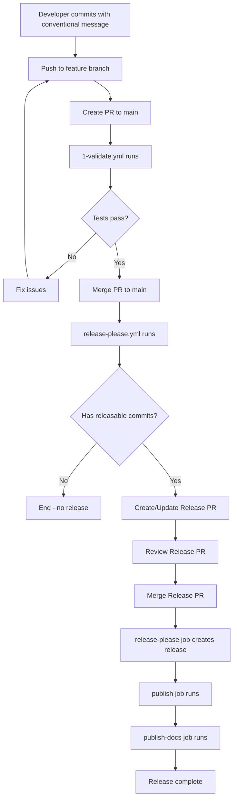
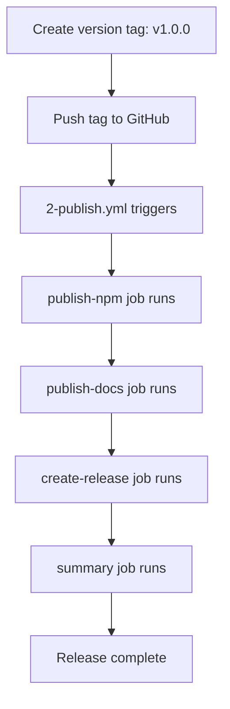

# Workflow Strategy for OpenCode Plugin Generator

> **Last Updated**: December 2024  
> **Status**: Implemented in plugin generator  
> **Primary Approach**: Release Please with Conventional Commits

## Overview

The OpenCode plugin generator creates a comprehensive CI/CD setup using GitHub Actions workflows. The strategy uses
**Release Please** as the primary release mechanism, with additional workflows for validation, manual releases, and
documentation deployment.

## Workflow Architecture

### Primary Workflows

#### 1. release-please.yml (Primary Release Mechanism)

**Purpose**: Automated release management based on conventional commits

**Trigger**:

- Push to `main` branch
- Manual dispatch

**Features**:

- Creates/updates release PRs automatically
- Bumps versions based on conventional commit types
- Generates CHANGELOG.md from commits
- Publishes to npm when release PR is merged
- Deploys documentation to GitHub Pages

**Jobs**:

1. **release-please**: Run Release Please action
2. **publish**: Full validation + npm publication
   - Lint, type-check, test with coverage, build
   - Check if version already published (avoid duplicates)
   - Publish with provenance and error handling
   - Verify publication with retry logic
3. **publish-docs**: Deploy documentation
   - Build Astro documentation site
   - Deploy to `docs` branch using peaceiris/actions-gh-pages

**Configuration Files Required**:

- `.github/release-please-config.json`
- `.github/.release-please-manifest.json`

#### 2. 1-validate.yml (PR Validation)

**Purpose**: Comprehensive validation for pull requests

**Trigger**: Pull requests to `main` or `develop`

**Jobs**:

1. **validate**: Lint, test, type-check, build
   - Format checking (Prettier)
   - Markdown linting
   - ESLint
   - TypeScript type checking
   - Tests with coverage (Codecov integration)
   - Build verification
2. **security**: Security analysis
   - Trivy vulnerability scanning
   - SARIF upload to GitHub Code Scanning
3. **pr-analysis**: PR size analysis
   - Warns on large PRs (>20 files or >500 lines)
   - Automated comment on oversized PRs

**Features**:

- Dependency caching for faster builds
- Skips on Release Please PRs (`version-bump/` branches)
- Concurrent execution with automatic cancellation

#### 3. 2-publish.yml (Manual Release Fallback)

**Purpose**: Manual tag-based releases (backup mechanism)

**Trigger**:

- Push tags matching `v*` pattern
- Manual workflow dispatch with tag input

**Jobs**:

1. **publish-npm**: Full validation + npm publication
2. **publish-docs**: Documentation deployment
3. **create-release**: GitHub release creation
   - Generates changelog from git commits
   - Creates release with package information
4. **summary**: Overall status summary

**Use Cases**:

- Emergency releases outside conventional commit flow
- Hotfixes requiring immediate deployment
- Manual version control scenarios

### Supporting Workflows

#### 4. deploy-docs.yml (Standalone Documentation)

**Purpose**: Deploy documentation independently of releases

**Trigger**:

- Push to `main` with changes in `docs/**` or `pages/**`
- Release published
- Manual dispatch

**Features**:

- Transforms markdown from `docs/` to Astro content
- Builds Astro site with Playwright browser installation
- Verifies internal links before deployment
- Deploys to GitHub Pages using official actions/deploy-pages

**Configuration Required**:

- Repository must have GitHub Pages enabled
- Pages source: GitHub Actions

#### 5. chores-pages.yml (Health Check)

**Purpose**: Verify GitHub Pages configuration

**Trigger**:

- Daily at 00:00 UTC (scheduled)
- Manual dispatch

**Features**:

- Checks Pages API for configuration
- Creates GitHub issue on misconfiguration
- Prevents duplicate issues with labeling

## Conventional Commits Strategy

### Commit Types and Version Bumps

| Commit Type        | Version Bump  | Changelog Section | Example                         |
| ------------------ | ------------- | ----------------- | ------------------------------- |
| `feat:`            | Minor (0.X.0) | Features          | `feat: add notification themes` |
| `fix:`             | Patch (0.0.X) | Bug Fixes         | `fix: resolve timeout issue`    |
| `feat!:`           | Major (X.0.0) | Features          | `feat!: redesign API`           |
| `BREAKING CHANGE:` | Major (X.0.0) | Features          | (in commit body)                |
| `perf:`            | Patch (0.0.X) | Performance       | `perf: optimize parser`         |
| `docs:`            | None          | Documentation     | `docs: update README`           |
| `style:`           | None          | Hidden            | `style: format code`            |
| `refactor:`        | None          | Code Refactoring  | `refactor: simplify logic`      |
| `test:`            | None          | Hidden            | `test: add unit tests`          |
| `chore:`           | None          | Hidden            | `chore: update deps`            |
| `ci:`              | None          | Hidden            | `ci: update workflow`           |

### Commit Message Format

```bash
<type>[optional scope]: <description>

[optional body]

[optional footer(s)]
```

**Examples**:

```bash
# Feature (minor bump)
feat: add support for custom notification sounds

# Bug fix (patch bump)
fix: resolve connection timeout in notification service

# Breaking change (major bump) - Method 1
feat!: redesign plugin initialization API

# Breaking change (major bump) - Method 2
feat: redesign plugin initialization API

BREAKING CHANGE: Plugin now requires async initialization.
Migration: Replace `new Plugin()` with `await Plugin.create()`

# Documentation (no bump)
docs: add troubleshooting guide for Windows users

# Multiple issues
fix: resolve memory leak in event handler

Closes #123, #456
```

## Release Please Configuration

### release-please-config.json

```json
{
  "$schema": "https://raw.githubusercontent.com/googleapis/release-please/main/schemas/config.json",
  "packages": {
    ".": {
      "release-type": "node",
      "package-name": "@pantheon-org/opencode-plugin-name",
      "include-component-in-tag": false,
      "changelog-sections": [
        { "type": "feat", "section": "Features", "hidden": false },
        { "type": "fix", "section": "Bug Fixes", "hidden": false },
        { "type": "perf", "section": "Performance Improvements", "hidden": false },
        { "type": "revert", "section": "Reverts", "hidden": false },
        { "type": "docs", "section": "Documentation", "hidden": false },
        { "type": "style", "section": "Code Style", "hidden": true },
        { "type": "chore", "section": "Miscellaneous", "hidden": true },
        { "type": "refactor", "section": "Code Refactoring", "hidden": false },
        { "type": "test", "section": "Tests", "hidden": true },
        { "type": "build", "section": "Build System", "hidden": true },
        { "type": "ci", "section": "Continuous Integration", "hidden": true }
      ],
      "bump-minor-pre-major": true,
      "bump-patch-for-minor-pre-major": false,
      "draft": false,
      "prerelease": false
    }
  },
  "bootstrap-sha": "",
  "skip-github-release": false,
  "draft": false,
  "prerelease": false
}
```

### .release-please-manifest.json

```json
{
  ".": "0.1.0"
}
```

**Note**: This file is automatically updated by Release Please. Initial version should match `package.json`.

## Workflow Execution Flow

### Standard Development Flow



### Manual Release Flow



## Action Version Management

The generator uses template variables for GitHub Actions versions, managed centrally in `github-actions-versions.ts`:

```typescript
export const GITHUB_ACTIONS_VERSIONS = {
  checkout: 'actions/checkout@...',
  setupNode: 'actions/setup-node@...',
  setupBun: 'oven-sh/setup-bun@...',
  cache: 'actions/cache@...',
  githubScript: 'actions/github-script@...',
  releasePlease: 'googleapis/release-please-action@...',
  // ... more actions
};
```

Templates reference these via EJS:

```yaml
- uses: <%= actions.checkout %>
- uses: <%= actions.setupBun %>
```

## Error Handling and Verification

### npm Publication

The workflows include robust error handling for npm publication:

1. **Pre-check**: Verify version not already published
2. **Publication**: Attempt publish with provenance
3. **Error details**: Detailed error messages for common issues
4. **Verification**: Retry logic (6 attempts, 15s intervals)

### Documentation Deployment

Documentation deployment includes:

1. **Link verification**: Playwright-based internal link checking
2. **Transform validation**: Ensures docs transform correctly
3. **Build verification**: Astro build must succeed
4. **Deployment confirmation**: Uses official GitHub Actions

## Repository Setup Requirements

### Secrets

Required repository secrets:

1. **NPM_TOKEN**: npm granular access token
   - Scope: "Read and write" for package
   - Organization: `@pantheon-org`
   - Generate: https://www.npmjs.com/settings/~/tokens

2. **WORKFLOW_PAT** (optional): Personal access token for Release Please
   - Scope: `repo`, `workflow`
   - Allows Release Please to trigger workflows
   - Fallback: Uses `GITHUB_TOKEN` if not provided

3. **CODECOV_TOKEN** (optional): Codecov integration
   - For test coverage reporting
   - Get from: https://codecov.io

### GitHub Pages Configuration

1. Enable GitHub Pages in repository settings
2. Source: GitHub Actions
3. Branch: Not used (Actions deploy directly)

### Branch Protection

Recommended branch protection for `main`:

- Require pull request reviews
- Require status checks to pass: `validate`, `security`
- Require conversation resolution
- No force pushes
- No deletions

## Best Practices

### For Plugin Developers

1. **Always use conventional commits**: Required for automated releases
2. **Write descriptive commit bodies**: Appears in CHANGELOG
3. **Reference issues**: Use `Closes #123` in commit footer
4. **Test locally first**: Run `bun test && bun run build` before pushing
5. **Review Release PRs carefully**: Verify version bumps and changelog

### For Plugin Maintainers

1. **Configure secrets immediately**: Add NPM_TOKEN before first release
2. **Enable GitHub Pages**: Required for documentation deployment
3. **Monitor workflow runs**: Check Actions tab for issues
4. **Keep dependencies updated**: Dependabot PRs should be reviewed regularly
5. **Document breaking changes**: Use `BREAKING CHANGE:` footer for major bumps

### For Monorepo Integration

When mirroring from monorepo:

1. **Preserve commit history**: Use `git subtree` or similar
2. **Tag format**: Use `plugin-name@v1.0.0` in monorepo
3. **Sync workflows**: Keep mirror workflows in sync with monorepo
4. **Independent versioning**: Each plugin versions independently

## Troubleshooting

### Release Please Not Creating PR

**Symptoms**: Commits pushed to main, but no release PR created

**Solutions**:

1. Verify commits follow conventional format
2. Check `.github/release-please-config.json` exists
3. Ensure `release-please.yml` workflow is enabled
4. Verify no `paths-ignore` is blocking commits

### npm Publish Fails

**Symptoms**: Publish job fails with authentication error

**Solutions**:

1. Verify `NPM_TOKEN` secret is set
2. Check token has "Read and write" permissions
3. Verify token hasn't expired
4. Check package name is available on npm

### Documentation Not Deploying

**Symptoms**: Docs job succeeds but Pages doesn't update

**Solutions**:

1. Verify GitHub Pages is enabled
2. Check Pages source is "GitHub Actions"
3. Ensure `pages/` directory has valid Astro config
4. Test docs build locally: `cd pages && bun run build`

### Workflow Permissions Error

**Symptoms**: Workflow fails with "Resource not accessible"

**Solutions**:

1. Check repository permissions in Settings > Actions
2. Verify "Read and write permissions" is enabled
3. Add specific permissions to workflow file if needed

## Migration Guide

### From Manual Releases

If migrating from manual tag-based releases:

1. Add Release Please configuration files
2. Enable `release-please.yml` workflow
3. Start using conventional commits
4. Keep `2-publish.yml` as fallback
5. First release: Create initial tag or use workflow_dispatch

### From Other CI Systems

If migrating from CircleCI, Travis, etc.:

1. Copy workflow files to `.github/workflows/`
2. Configure secrets in GitHub repository settings
3. Enable GitHub Actions in repository
4. Test workflows with manual dispatch
5. Monitor first few releases closely

## Related Documentation

- [Release Please Documentation](https://github.com/googleapis/release-please)
- [Conventional Commits](https://www.conventionalcommits.org/)
- [GitHub Actions Documentation](https://docs.github.com/en/actions)
- [npm Provenance](https://docs.npmjs.com/generating-provenance-statements)
- [Semantic Versioning](https://semver.org/)

## Summary

The workflow strategy provides:

- ✅ **Automated releases** with Release Please
- ✅ **Comprehensive validation** on every PR
- ✅ **Manual fallback** for emergency releases
- ✅ **Documentation deployment** integrated with releases
- ✅ **Health monitoring** with daily checks
- ✅ **Security scanning** with Trivy
- ✅ **Conventional commits** enforcement via changelog generation

This strategy ensures reliable, automated releases while maintaining flexibility for special cases and providing robust
validation at every step.
